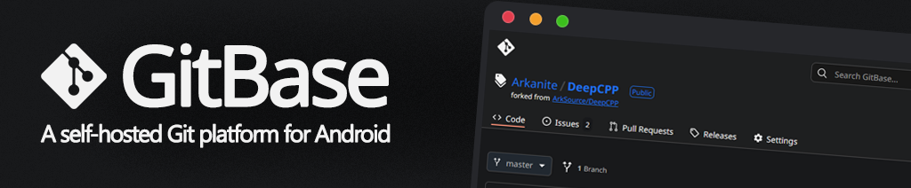
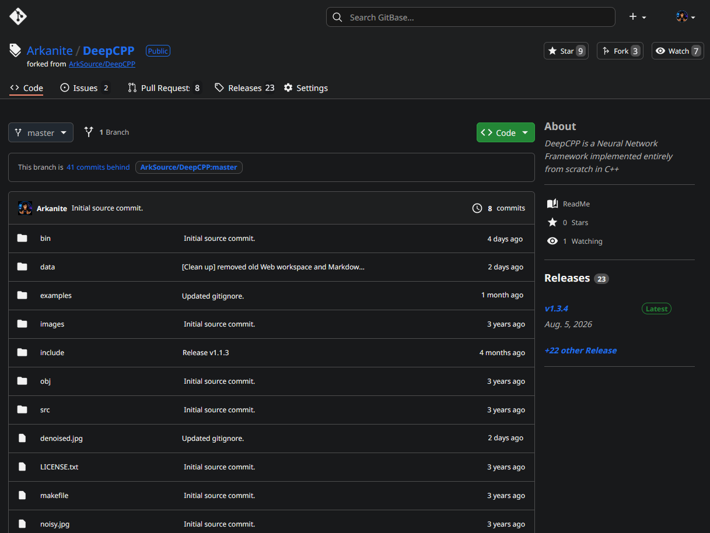
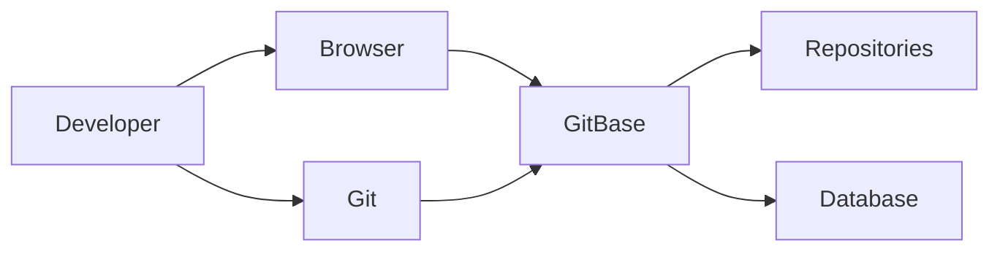

<h1>
  
  GitBase
</h1>

<h3>Private. Self-hosted. Version Control.</h3>

  <strong>Run your own Git collaboration platform directly on Android.</strong>
  

  

  🔹Host repositories. 🔹Review pull requests. 🔹Track issues. 🔹Manage releases.
   
  Everything stays on your own device.

[Discuss, ask questions & request features](../../discussions)

## What is GitBase?
GitBase transforms your Android device into a private, self-hosted Git collaboration platform. Host repositories, manage projects, review changes, track issues, and collaborate through a built-in web interface — all while keeping your source code and data under your control.

## Why GitBase?
GitBase was built for developers who want full ownership of their development workflow.

Whether you're working on a local network, building software in the field, maintaining an offline development environment, or simply prefer to self-host your infrastructure, GitBase provides a familiar Git experience without depending on external services.

## Why Android?
Modern Android devices provide excellent networking, storage, and processing capabilities, making them ideal as portable self-hosted development servers.
GitBase turns hardware you already own into a complete Git collaboration platform.

## Git Hosting

GitBase provides a fully featured HTTP Git server compatible with standard Git clients and command-line tools.

Use your existing Git workflow to:

- Clone repositories
- Push and pull changes
- Fetch updates
- Create and switch branches
- Merge branches
- Tag releases

Whether you're using Git CLI, an IDE, or a desktop client, GitBase works seamlessly with your existing tools.

## Web Interface

GitBase includes a modern, responsive web interface that provides a familiar GitHub-style experience directly from your browser.

Manage and collaborate through:

- Repository browsing
- Commit history and branch views
- Pull requests and code reviews
- Issue tracking
- Release management
- User accounts
- Repository permissions
- Administrative settings

Accessible from any device on your local network, the GitBase web interface gives you complete control over your development environment.

## Collaboration

GitBase supports collaborative development for individuals and teams:

- Pull requests with review workflows
- Branch comparison
- Issue tracking and assignment
- Repository forking
- Multiple users and permissions
- Release management

## Architecture

## Documentation
- [Documentation](docs/documentation.md)
- [FAQ](docs/faq.md)

## Support
- GitHub Discussions: [Discuss, ask questions & request features](../../discussions)
- Issues: [Report bugs](https://github.com/ArkSource/GitBase/issues)

## License
This repository is licensed under the [Commercial Software License](LICENSE.md).
GitBase is proprietary, closed-source software.   
This repository does not contain the application's source code.

Thank you to all users who make this project possible!
